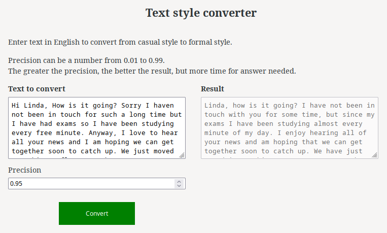

# Формализация текста
## Итоговый проект по дисциплине "Программная инженерия II"
## Группа 4 
Состав группы:
 - Dmitrii-Krasnov: Дмитрий Краснов
 - svwk: Светлана Савоськина
 - GLOBB1000: Артем Солодухин
 - Oshutkova: Дарья Руденко

 ## Описание проекта
Конвертация стиля текста из казуального в формальный.  

 ## Использованные технологии
 - fastapi>=0.95.1
- uvicorn>=0.21.1
- pydantic>=1.10.7
- transformers>=4.28.0
- torch>=1.13.0
- httpx>=0.24.0
- styleformer @ git+https://github.com/PrithivirajDamodaran/Styleformer.git@main

## Установка
- Для установки зависимостей для сервера, выполните команду:

  `pip install -r requirements.txt`

- Для установки зависимостей для веб-клиента, выполните команду в директории WebClient:

  `npm install`

## Использование
### Запуск сервера
- Для запуска выполните:

`uvicorn main:app --reload`

- Для работы с приложением перейдите по ссылке:
http://127.0.0.1:8000/docs

- Откроется окно swagger, в котором есть два роута (метода):
  - Роут "/" покажет описание проекта.
  - Роут "/convert" выполняет конвертацию текста. 

### Запуск JS веб-клиента:
- Выполните команду в директории WebClient 

  `npx ng serve` 
- Перейдите по ссылке http://localhost:4200/.

- Откроется страница, в которой можно выполнить преобразование:

